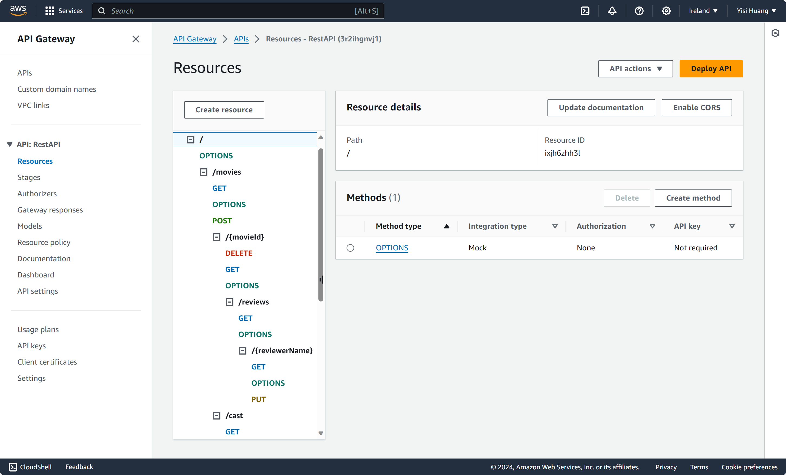
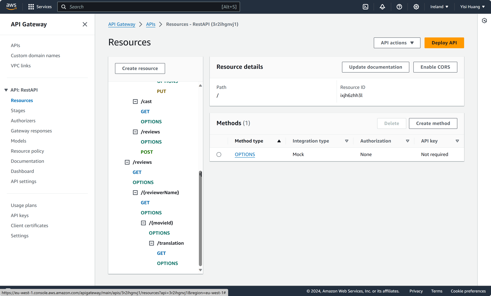
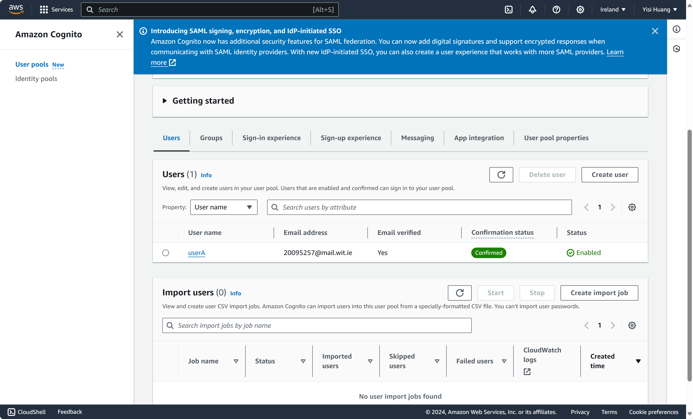

## Serverless REST Assignment.

__Name:__ Yisi Huang

__Video demonstration:__ https://youtu.be/Sqd1seoJaNY

This repository contains an implementation of a serverless REST API for the AWS platform. The CDK framework is used to provision its infrastructure. The API's domain context is movie reviews.

### API endpoints.
 
+ POST /movies/reviews - add a movie review.
+ GET /movies/{movieId}/reviews - Get all the reviews for a movie with the specified id.
+ GET /movies/{movieId}/reviews?minRating=n - Get all the reviews for the film with the specified ID whose rating was higher than the minRating.
+ GET /movies/{movieId}/reviews/{reviewerName} - Get the review for the movie with the specified movie ID and written by the named reviewer.
+ PUT /movies/{movieId}/reviews/{reviewerName} - Update the text of a review.
+ GET /movies/{movieId}/reviews/{year} - Get the reviews written in a specific year for a specific movie.
+ GET /reviews/{reviewerName} - Get all the reviews written by a specific reviewer.
+ GET /reviews/{reviewerName}/{movieId}/translation?language=code - Get a translated version of a movie review using the movie ID and reviewer name as the identifier.

### Authentication (if relevant).

### Independent learning (If relevant).

When deploying the gateway GET /movies/{movieId}/reviews/{year}, an error was generated. I learnt that the API Gateway cannot distinguish between the path parameters {reviewerName} and {year} because they are both defined using the same location and format. So I had to deploy the GET /movies/{movieId}/reviews/{reviewerName} endpoint and combine the {year} lambda function with the {reviewerName} one to return the appropriate result by determining whether the request is for a reviewer name or a year, i.e. the {reviewerName} endpoint can achieve both GET /movies/{movieId}/reviews/{reviewerName} and GET /movies/{movieId}/reviews/{year} functions, which can be clearly seen in the video demonstration.

When implementing the translation functionality, I avoided performance issues and ensured the successful execution of the request by adding an index to the indexes in DynamoDB so that the query could quickly look up the data directly using the indexes. I also learnt language character abbreviations for smooth testing.